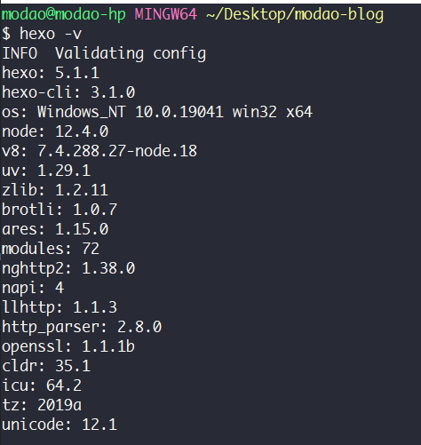
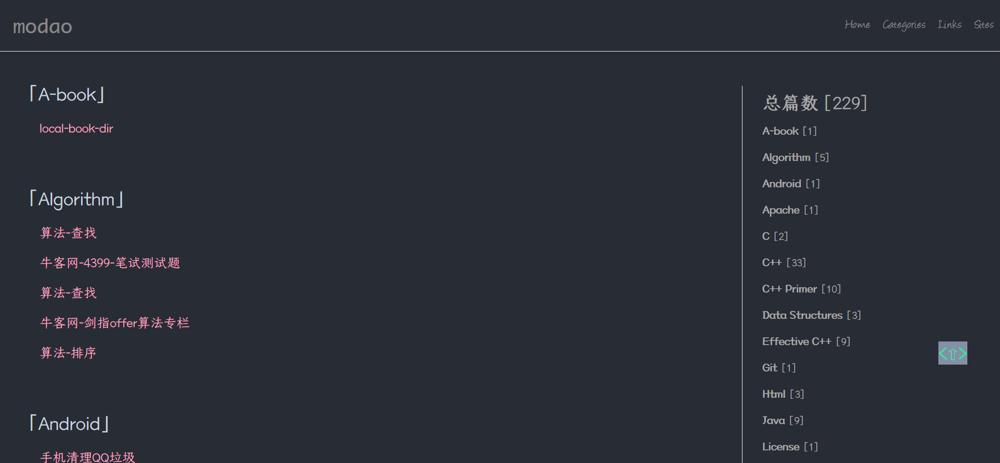
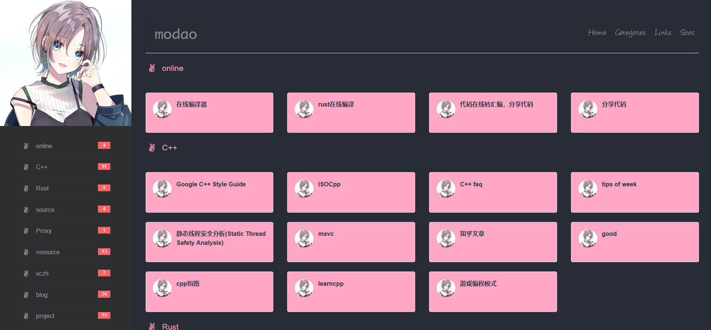

# A hexo theme : modao

## 介绍

A super simple Theme for Hexo.

modao’s blog：https://modao233.gitee.io

## 我的hexo版本



## 我觉得的特性

### PDF支持

由于我在主题里放了pdf.js，让主题支持了预览电子书（pdf）


使用方法是在markdown文件里这样写：

```
{% iframe /pdf.js/web/viewer.html?file=/book/xx.pdf 100% 400 %}
```

将你的pdf文件放`themes/modao/source/book/`里

For more use, please refer to official documents:[PDF.js](https://github.com/mozilla/pdf.js)

### 我觉得好看的分类页面

不支持子分类，支持多分类。

具体写法就这样：`categories: [分类1,分类2]`



### 我觉得有用的导航页面

使用格式像这样：

```
---
layout: navigation     # 必须
title: 莫道的导航页   # 可选，反正填了也没显示
links:
  - group: online
    items:
    - name: 在线编译器
      url: https://ideone.com/
    - name: 代码在线转汇编，分享代码
      url: https://godbolt.org/
    - name: 分享代码
      url: https://paste.ubuntu.com/
  - group: C++
    items:
    - name: Google C++ Style Guide
      url: https://google.github.io/styleguide/cppguide.html
---
```



## 其它

目前没想到